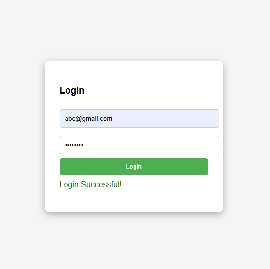

# Login Page Testing Project ✅

This is a **Login Project** designed for manual testing.

## 📋 Test Cases Covered:

| Test Case ID | Scenario |
|--------------|----------|
| TC_01 | Login with valid email & password |
| TC_02 | Login with invalid email |
| TC_03 | Login with invalid password |
| TC_04 | Both fields empty |
| TC_05 | Valid email + Empty password |
| TC_06 | Empty email + Valid password |

## 💻 Technology Used:

- HTML5
- CSS3
- JavaScript (Frontend Validation Only)

## 🖼️ Preview:

## 🚀 How to Run:

1. Clone this repo or download the ZIP.
2. Open `index.html` in your browser.
3. Perform manual testing based on provided test cases.

## 🔒 Test Credentials:

| Email | Password |
|--------|----------|
| abc@gmail.com | test@123 |

## 📧 Contact

Created by **Yeshwant Waware**

Feel free to connect on [LinkedIn](https://www.linkedin.com/in/yashwant-wawre-689671198?utm_source=share&utm_campaign=share_via&utm_content=profile&utm_medium=android_app) or contribute!
